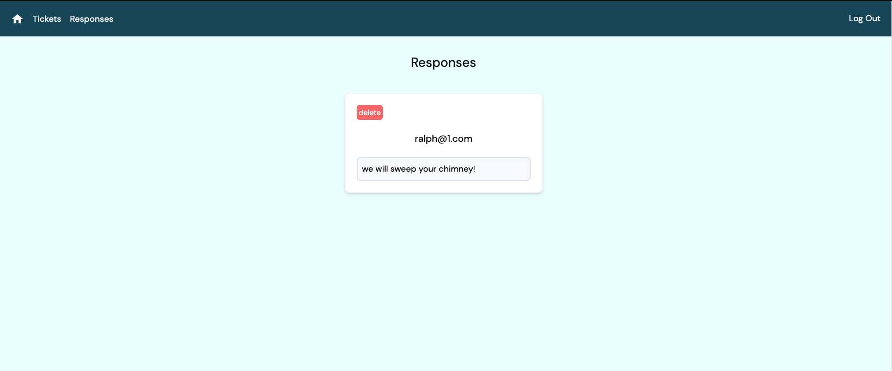

Hello Devs! :) 

This is my implementation of a 'help desk' for a code challenge for Stealth Health.

Regular users can submit tickets for help requests.

The admin can create view, edit, delete, and respond to tickets. Responses are logged under the 'responses' tab in the nav. 

In order to log into the admin account, click 'admin login' in the nav, and enter the credentials provided.

<========= admin credentials =======>

username:admin1
password:Password1

<====================================>

This app is also deployed on netlify @ https://bejewelled-sunflower-449f28.netlify.app/ Please have a look :) 

